# EW-Resilient Multi-Sensor Threat Tracking & Trajectory Prediction

[](https://www.python.org/)
[](https://pytorch.org/)
[](https://github.com/JSBSim-Team/jsbsim)
[](https://onnx.ai/)

Target tracking algorithms face severe challenges when exposed to active Electronic Warfare (EW)—such as radar noise jamming, range-gate pull-off (RGPO), or intermittent packet drops. Classical kinematic filters (such as Singer EKFs) struggle under nonlinear multi-axis combat maneuvers and corrupted sensor innovations over extended horizons, while unconstrained deep learning baselines (such as unanchored LSTMs) lack physical boundary grounding and often output aerodynamically infeasible trajectories.

This repository serves as the public technical verification showcase for the research-grade EW-resilient trajectory prediction and multi-sensor fusion engine.

The hybrid deep learning pipeline combines:
1. **Cross-Attention Transformer:** Fuses asynchronous, multi-rate sensor inputs (Radar, EO/IR, RF/ESM) and uses reliability gating to automatically down-weight jammed sensors.
2. **Physics-Informed Neural Network (PINN):** Continuously forecasts future trajectories ($t \in [0, 5\text{s}]$) while penalizing load factors exceeding $9\text{G}$, enforcing realistic flight envelopes, and budgeting aerodynamic drag and thrust.
3. **JSBSim 6-DoF Simulation:** Validates performance against an F-16 flight dynamics model under tactical combat maneuvers (coordinated turns, climbs, dives, S-turns at Mach ~0.8).

---

## Quick Start / Architecture Verification

> [!NOTE]
> **Public Technical Showcase Scope:**  
> The public demo intentionally provides a minimal reference implementation of selected architectural mechanisms; the full multi-threaded training pipeline, 6-DoF JSBSim simulation harness, real-time C2 UDP streaming harness, automated test suite, and proprietary model checkpoints remain private.

A self-contained reference implementation of the core neural architecture is provided in `demo_pipeline.py`. It requires only PyTorch to run:

```bash
python demo_pipeline.py
```

This script verifies:
- Continuous **Time2Vec** embeddings on asynchronous timestamps.
- **Reliability gating** de-weighting corrupted sensor channels under EW noise.
- Continuous-time **$C^1$ boundary pinning** ($p(0) = p_0, \dot{p}(0) = v_0$).
- Exact autograd derivatives ($\mathbf{v} = \dot{\mathbf{p}}$, $\mathbf{a} = \ddot{\mathbf{p}}$) penalizing load factor violations ($|N_z| \le 9.0\text{ G}$).

---

## Architecture

```mermaid
flowchart TD
    subgraph Inputs ["Asynchronous Sensor Streams"]
        direction TB
        R["Radar (~10 Hz)<br/>Range, Az/El, Doppler"]
        EO["EO/IR (~30 Hz)<br/>Bearing, Elevation"]
        ESM["RF / ESM (~5 Hz)<br/>AOA, Signal Strength"]
        EW["EW Environment<br/>Noise Jamming / Dropped Packets"] -.->|Corrupts| R
    end

    subgraph Fusion ["1. Cross-Attention Transformer"]
        direction TB
        Tok["Continuous Tokenizer<br/>(Time2Vec + Sensor Embeddings)"]
        Gate["Cross-Attention + Reliability Gate<br/>(Penalizes high-variance / jammed inputs)"]
        Tok --> Gate
    end

    subgraph Predictor ["2. Continuous-Time PINN Decoder"]
        direction TB
        MLP["Latent State -> Trajectory Head"]
        Phys["Autograd Differential Constraints<br/>• Load factor |Nz| <= 9G<br/>• Energy & velocity bounds"]
        MLP --> Phys
    end

    Inputs --> Tok
    Gate --> MLP
    Phys --> Out["Output: 5-Second Forecast (Sub-10ms Latency)"]

    style EW stroke:#e74c3c,stroke-width:2px,stroke-dasharray: 5 5
    style Fusion fill:#161b22,stroke:#30363d
    style Predictor fill:#161b22,stroke:#30363d
```



---

## Why This Works

* **Asynchronous clocks without fixed resampling:** Radar (10Hz), EO/IR (30Hz), and ESM (5Hz) run at different rates. Using continuous Time2Vec representations lets the network process sensor packets whenever they arrive instead of forcing brittle interpolation.
* **Soft sensor isolation:** When radar jamming turns on, the reliability gate drops the attention weight on radar tokens and relies primarily on passive EO/IR and RF bearings.
* **Hard kinematic boundary pinning:** By formulating the decoder as:
  $$p(t) = p_0 + v_0 t + t^2 \cdot \Delta p_\theta(t)$$
  The trajectory at $t=0$ identically equals the estimated position $p_0$, and its first derivative $\dot{p}(0)$ identically equals $v_0$ by construction. This guarantees zero jump discontinuities at the handover boundary.
* **Physics limits via autograd:** Accelerations and velocities are computed analytically inside the network graph ($v = \dot{p}$, $a = \ddot{p}$). During training, autograd differential loss terms penalize load factors exceeding the aircraft's structural limit ($|N_z| > 9.0\text{ G}$) and energy budget. Across all benchmark evaluation points, **0.00% physics violations are observed**.

---

## Benchmark Evaluation & Analysis

The evaluation is conducted on a standardized benchmark dataset of 20 tactical 6-DoF JSBSim F-16 flight scenarios (1,060 sliding evaluation windows, 100-step observation history, 50-step / 5.0-second forecast horizon at Mach ~0.8 / ~250 m/s combat maneuvers).

### Scientific Context & Error Decomposition

> The transition from the earlier synthetic benchmark to the JSBSim-based 6-DoF benchmark increased the observed end-to-end trajectory error substantially, reflecting both the increased complexity of nonlinear flight dynamics and a previously under-characterized initial-state estimation error.
> 
> A controlled error decomposition across 1,060 evaluation windows showed that the dominant source of the observed ~1.2–1.3 km end-to-end error is the estimated initial position. Removing the initial-position error reduces the 1-second trajectory RMSE by 95.5% (from 1,181.0 m to 52.9 m) and the 5-second RMSE from 1,316.9 m to 285.7 m. When both initial position and velocity were provided from ground truth, the same trajectory decoder produced 3.6 m, 31.7 m, and 89.1 m RMSE at 1, 3, and 5 seconds, respectively.
> 
> This indicates that the current system's primary limitation is state handover accuracy rather than uncontrolled trajectory divergence. The benchmark also exposed an angular innovation-wrapping defect in the Singer EKF baseline; after correcting the circular-angle handling, its 5-second RMSE decreased from the previously reported 43 km to approximately 1.15 km.
> 
> Accordingly, the current results are best interpreted as a separation between three capabilities: sensor-to-state estimation, physics-constrained trajectory extrapolation, and end-to-end tracking. The project currently demonstrates strong trajectory extrapolation behavior under an accurate initial state, while the state-estimation head remains the principal area for further improvement.

---

### Standardized Three-Track Evaluation Framework

To provide full scientific rigor, system performance is analyzed across three decoupled tracks:

#### Track 1: Sensor-to-State Estimation (Handover Accuracy)
Evaluates the Transformer fusion backbone's ability to estimate the target's current kinematic state $(\mathbf{p}_0, \mathbf{v}_0)$ at $t=0$ directly from asynchronous, EW-corrupted multi-sensor packets:

| Metric | Condition | All Windows ($N=1{,}060$) | Clean Sensors | Jammed (EW) |
| :--- | :--- | :---: | :---: | :---: |
| **Initial Position Error (IPE)** | RMSE | **1,153.53 m** | 1,169.27 m | 1,132.83 m |
| | Mean (Median) | 1,008.31 m (878.54 m) | 1,023.94 m | 988.08 m |
| **Initial Velocity Error (IVE)** | RMSE | **52.26 m/s** | 49.27 m/s | 55.90 m/s |
| | Mean | 43.13 m/s | 40.82 m/s | 46.12 m/s |

*Key finding:* The initial state error is bounded and comparable across clean and EW conditions, confirming that reliability gating effectively isolates jammed sensor bursts. However, the residual ~1.15 km initial position offset acts as a baseline displacement that is inherited by downstream trajectory extrapolation.

---

#### Track 2: Physics-Constrained Dynamics Extrapolation (State-Controlled Ablation)
Evaluates the continuous-time PINN decoder's dynamic extrapolation capability when provided with controlled initial states, decoupling trajectory modeling from sensor estimation error:

| Decoder Configuration | 1.0s Horizon | 3.0s Horizon | 5.0s Horizon | ADE (1–5s) | FDE @ 5.0s |
| :--- | :---: | :---: | :---: | :---: | :---: |
| **Oracle $\mathbf{p}_0$** (True Position, Predicted $\mathbf{v}_0$) | **52.86 m** | **163.59 m** | **285.71 m** | **140.04 m** | **241.25 m** |
| **Oracle $\mathbf{p}_0 + \mathbf{v}_0$** (True State $\to$ Pure Dynamics) | **3.63 m** | **31.71 m** | **89.10 m** | **32.81 m** | **89.10 m** |
| *Linear Constant-Velocity Extrapolation* | 1.72 m | 13.98 m | 37.12 m | — | 37.12 m |

**Geometric Error Decomposition at 5.0s (State-Aligned):**
- **Along-Track Error (Longitudinal / Speed):** Mean **84.08 m** (RMSE 107.79 m)
- **Cross-Track Error (Lateral Curvature / Turns):** Mean **242.91 m** (RMSE 300.70 m)

*Key finding:* When provided with an accurate initial state, the PINN decoder exhibits substantially lower trajectory extrapolation error (**285.7 m @ 5.0s** with true $\mathbf{p}_0$, down to **89.1 m @ 5.0s** under full state oracle). The geometric breakdown reveals that extrapolation error is predominantly lateral (cross-track), aligning with high-G evasive turns where aerodynamic lift vector changes are hardest to extrapolate.

---

#### Track 3: End-to-End Tracking (Sensors $\to$ State $\to$ Trajectory)
Evaluates the complete end-to-end pipeline (raw asynchronous sensor packets $\to$ fusion $\to$ state estimation $\to$ 5.0-second forecast) against classical and deep learning baselines:

| Model | Condition | 1.0s Horizon | 3.0s Horizon | 5.0s Horizon | Phys. Violations | Latency |
| :--- | :--- | :---: | :---: | :---: | :---: | :---: |
| **PINN-Transformer (Ours)** | **All** | **1,180.4 m** | **1,242.1 m** | **1,315.9 m** | **0.00%** | **8.07 ms** |
| | Clean | 1,197.2 m | 1,260.0 m | 1,334.5 m | 0.00% | 8.07 ms |
| | Jammed (EW) | 1,158.4 m | 1,218.6 m | 1,291.5 m | 0.00% | 8.07 ms |
| **Singer 9-State EKF** *(Corrected)* | All | 138.5 m | 512.4 m | 1,152.0 m | 0.00% | 2.90 ms |
| | Clean | 90.9 m | 261.9 m | 568.4 m | 0.00% | 2.90 ms |
| | Jammed (EW) | 182.6 m | 716.7 m | 1,620.8 m | 0.00% | 2.90 ms |
| **LSTM Baseline** *(Unanchored)* | All | 6,190.8 m | 6,524.6 m | 6,862.5 m | 0.00% | 3.12 ms |
| | Clean | 6,643.0 m | 6,987.5 m | 7,334.0 m | 0.00% | 3.12 ms |
| | Jammed (EW) | 5,550.9 m | 5,871.5 m | 6,199.2 m | 0.00% | 3.12 ms |

---

### Key Takeaways & Scientific Findings

1. **State Handover vs. Extrapolation Disconnect:**
   - Removing the initial position error reduces the 1-second trajectory RMSE by **95.5%** (from 1,181.0 m to 52.9 m) and the 5-second RMSE to **285.7 m**.
   - The trajectory decoder itself exhibits strong confinement and physical consistency; the observed ~1.2–1.3 km end-to-end error is overwhelmingly dominated by the initial position offset estimated by the fusion head from noisy, asynchronous sensors.

2. **Decoupled Comparison with Singer EKF:**
   - Under an accurate initial state, the continuous-time PINN decoder outperforms the classical Singer model by **4.0x** at the 5-second horizon (**285.7 m vs. 1,152.0 m**, and down to **89.1 m** under full state oracle).
   - In end-to-end tracking directly from raw sensors, the classical EKF achieves lower error at short horizons (138.5 m @ 1s vs. 1,180.4 m) but grows rapidly toward 5 seconds (1,152.0 m overall, 1,620.8 m under jamming), converging close to the PINN-Transformer's 1,315.9 m.
   - *EKF Innovation Fix:* The previously reported 43 km EKF error was an implementation artifact caused by circular-angle differencing across the $\pm 180^\circ$ discontinuity in azimuth/bearing innovations. Applying modular wrapping $(y + 180^\circ) \bmod 360^\circ - 180^\circ$ corrected the EKF 5.0s RMSE to 1.15 km.

3. **Unanchored Baselines vs. Physics-Informed Grounding:**
   - The unanchored LSTM baseline lacks $C^1$ kinematic boundary pinning and state supervision, wandering across the spatial envelope (~6.2–6.8 km error). Kinematic pinning and physical regularization are essential for high-speed tactical flight horizons.

4. **Empirical Physical Feasibility:**
   - **0.00% physics violations observed** across all benchmark evaluation points under evaluated physical constraints ($|N_z| \le 9.0\text{G}$).
   - The autograd loss regularizes the learned trajectory manifold during training to respect aerodynamic load factor and velocity bounds.

5. **Dataset Realism (Synthetic vs. JSBSim 6-DoF):**
   - A substantial portion of the earlier synthetic benchmark consisted of constant-velocity or near-zero-acceleration flight (~39.0% zero-acceleration ratio). The JSBSim 6-DoF benchmark introduces continuous multi-axis aerodynamic maneuvering at Mach ~0.8 (coordinated turns, climbs, dives, S-turns), presenting a far more challenging and realistic flight envelope.

6. **Real-Time Avionics Throughput:**
   - Forward-pass latency is **8.07 ms**, enabling real-time operation in >100 Hz tactical mission loops and avionics suites.

---

## Visualizations

### Tracking Error Progression


### Clean vs. Jammed Sensor Scenarios


### Sensor Attention Weights During Active Jamming
The cross-attention layer automatically de-prioritizes jammed sensor channels:


---

## Aerodynamic Maneuver Validation (JSBSim)

Flight truth profiles generated with JSBSim 6-DoF F-16 dynamics under standard military maneuvers:

| Coordinated Turn ($30^\circ$ Bank) | Climb / Dive Profile |
| :---: | :---: |
|  |  |

| S-Turn Reversal | Trimmed Level Flight |
| :---: | :---: |
|  |  |

---

## Tech Stack

* **Frameworks:** PyTorch, NumPy, SciPy
* **Simulation:** JSBSim Flight Dynamics Engine (F-16 model, WGS-84 $\to$ ENU coordinates)
* **Target Export:** ONNX Runtime / TensorRT

---

## Roadmap

- [x] Cross-attention fusion architecture + Time2Vec continuous tokenization.
- [x] Continuous-time PINN decoder with differential autograd physics loss (9G lateral limit + aerodynamic drag/thrust budget).
- [x] JSBSim 6-DoF aerodynamic maneuver simulator and dataset generation.
- [x] Direct training pipeline against the multi-threaded JSBSim flight pool.
- [ ] Dedicated state-estimation head refinement & tight sensor-to-state coupling.
- [ ] Embedded hardware profiling (NVIDIA Jetson Orin via TensorRT FP16).
- [ ] Multi-target track correlation and swarm scenarios.

---

<sub>*Note: This repository is a technical showcase containing architecture documentation, benchmark results, and an executable reference demo in `demo_pipeline.py`. Production mission simulation engines, real-time UDP streaming test harnesses, and proprietary training checkpoints are maintained internally as part of the flagship research project featured at [portfolio.omeryigitozbey1.workers.dev](https://portfolio.omeryigitozbey1.workers.dev/).*</sub>
