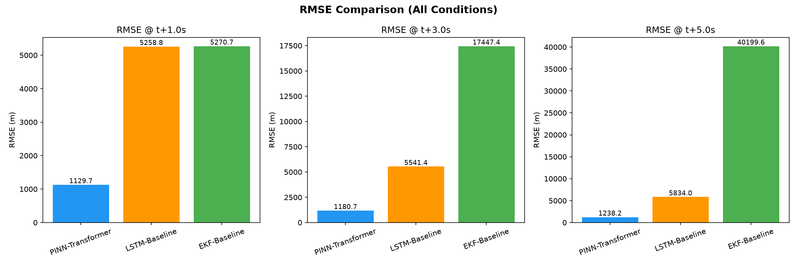
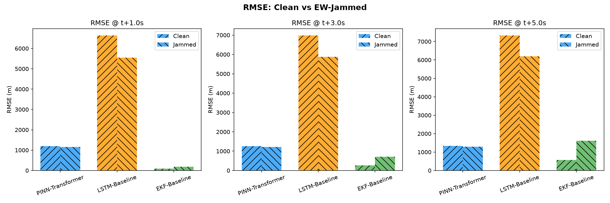
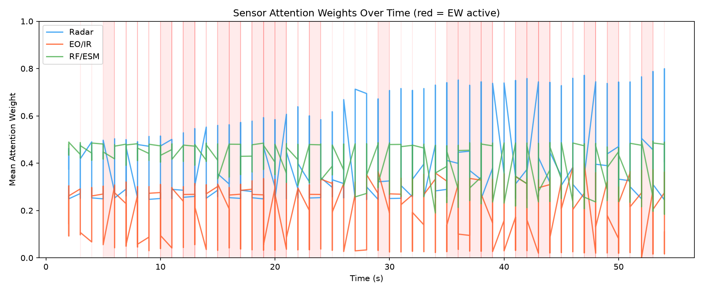
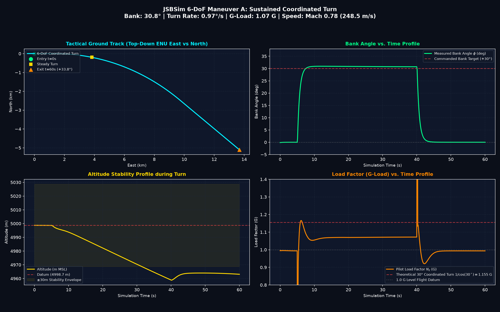
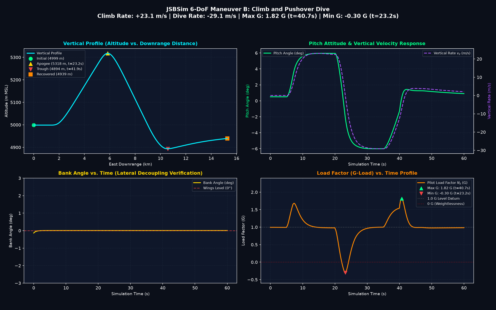
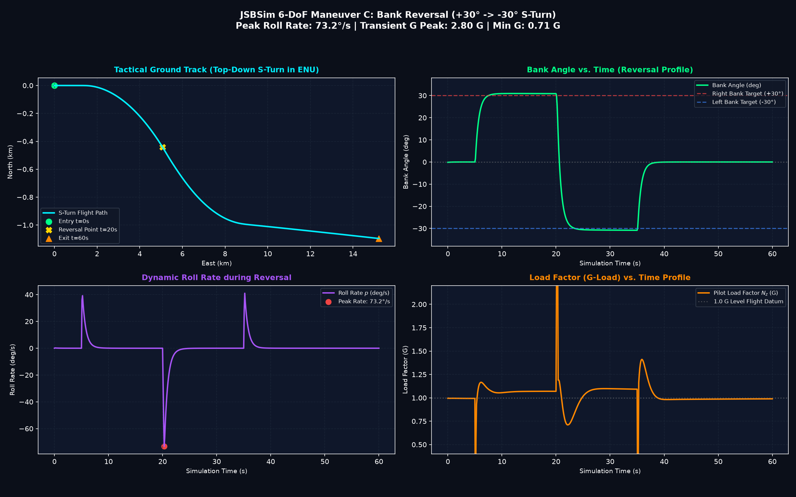
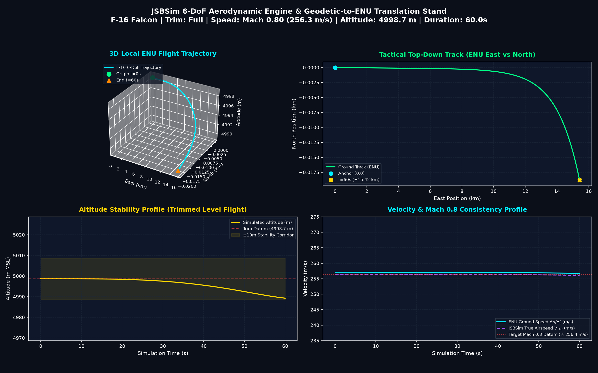

# EW-Resilient Multi-Sensor Threat Tracking & Trajectory Prediction

[](https://www.python.org/)
[](https://pytorch.org/)
[](https://github.com/JSBSim-Team/jsbsim)
[](https://onnx.ai/)

Target tracking algorithms usually break down when exposed to active Electronic Warfare (EW)—such as radar noise jamming, range-gate pull-off (RGPO), or intermittent packet drops. Classical filters (EKF) diverge, while generic deep learning baselines (LSTM) often output trajectories that violate basic aerodynamics (e.g., predicting an aircraft pulling 20G+ maneuvers).

This repository serves as the public technical verification showcase for the research-grade EW-resilient trajectory prediction and multi-sensor fusion engine

The hybrid deep learning pipeline combines:
1. **Cross-Attention Transformer:** Fuses asynchronous, multi-rate sensor inputs (Radar, EO/IR, ESM) and uses reliability gating to automatically down-weight jammed sensors.
2. **Physics-Informed Neural Network (PINN):** Continuously forecasts future trajectory ($t \in [0, 5\text{s}]$) while penalizing load factors exceeding $9\text{G}$, enforcing realistic flight envelopes, and budgeting aerodynamic drag and thrust.
3. **JSBSim 6-DoF Simulation:** Validates performance against an F-16 flight dynamics model under tactical combat maneuvers.

---

## Quick Start / Architecture Verification

> [!NOTE]
> **Public Technical Showcase Scope:**  
> The public demo intentionally provides a minimal reference implementation of selected architectural mechanisms; the full multi-threaded training pipeline, 6-DoF JSBSim simulation harness, real-time C2 UDP streaming harness, automated test suite, and proprietary model checkpoints remain private.

A self-contained reference implementation of the core neural architecture is provided in `demo_pipeline.py`. It requires only PyTorch to run:

```bash
python demo_pipeline.py
```

This script verifies:
- Continuous **Time2Vec** embeddings on asynchronous timestamps.
- **Reliability gating** de-weighting corrupted sensor channels under EW noise.
- Continuous-time **$C^1$ boundary pinning** ($p(0) = p_0, \dot{p}(0) = v_0$).
- Exact autograd derivatives ($\mathbf{v} = \dot{\mathbf{p}}$, $\mathbf{a} = \ddot{\mathbf{p}}$) enforcing $|N_z| \le 9.0\text{ G}$.

---

## Architecture

```mermaid
flowchart TD
    subgraph Inputs ["Asynchronous Sensor Streams"]
        direction TB
        R["Radar (~10 Hz)<br/>Range, Az/El, Doppler"]
        EO["EO/IR (~30 Hz)<br/>Bearing, Elevation"]
        ESM["RF / ESM (~5 Hz)<br/>AOA, Signal Strength"]
        EW["EW Environment<br/>Noise Jamming / Dropped Packets"] -.->|Corrupts| R
    end

    subgraph Fusion ["1. Cross-Attention Transformer"]
        direction TB
        Tok["Continuous Tokenizer<br/>(Time2Vec + Sensor Embeddings)"]
        Gate["Cross-Attention + Reliability Gate<br/>(Penalizes high-variance / jammed inputs)"]
        Tok --> Gate
    end

    subgraph Predictor ["2. Continuous-Time PINN Decoder"]
        direction TB
        MLP["Latent State -> Trajectory Head"]
        Phys["Autograd Differential Constraints<br/>• Load factor |Nz| <= 9G<br/>• Energy & velocity bounds"]
        MLP --> Phys
    end

    Inputs --> Tok
    Gate --> MLP
    Phys --> Out["Output: 5-Second Forecast (Sub-10ms Latency)"]

    style EW stroke:#e74c3c,stroke-width:2px,stroke-dasharray: 5 5
    style Fusion fill:#161b22,stroke:#30363d
    style Predictor fill:#161b22,stroke:#30363d
```



---

## Why This Works

* **Asynchronous clocks without fixed resampling:** Radar (10Hz), EO/IR (30Hz), and ESM (5Hz) run at different rates. Using continuous Time2Vec representations lets the network process sensor packets whenever they arrive instead of forcing brittle interpolation.
* **Soft sensor isolation:** When radar jamming turns on, the reliability gate drops the attention weight on radar tokens and relies primarily on passive EO/IR and RF bearings.
* **Hard kinematic boundary pinning:** By formulating the decoder as:
  $$p(t) = p_0 + v_0 t + t^2 \cdot \Delta p_\theta(t)$$
  The trajectory at $t=0$ identically equals the estimated position $p_0$, and its first derivative $\dot{p}(0)$ identically equals $v_0$. This guarantees zero jump discontinuities at the handover boundary.
* **Physics limits via autograd:** Accelerations and velocities are computed analytically inside the network graph ($v = \dot{p}$, $a = \ddot{p}$). If the network attempts to bend a trajectory sharper than the aircraft's aerodynamic capability ($|N_z| > 9.0\text{ G}$), the loss heavily penalizes it during training.

---

## Benchmark Results

Tested on a standardized benchmark dataset of 100 tactical 6-DoF JSBSim F-16 flight episodes (100-step observation history, 50-step forecast horizon, Mach ~0.8 / 250 m/s combat maneuvers).

### Tracking Error (RMSE in meters)

| Model | Condition | 1.0s Horizon | 3.0s Horizon | 5.0s Horizon | Phys. Violations | Latency |
| :--- | :--- | :---: | :---: | :---: | :---: | :---: |
| **PINN-Transformer** | **All** | **1,129.7 m** | **1,180.7 m** | **1,238.2 m** | **0.00%** | **7.34 ms** |
| **PINN-Transformer** | **Clean** | **1,078.3 m** | **1,130.2 m** | **1,191.3 m** | **0.00%** | **7.34 ms** |
| **PINN-Transformer** | **Jammed (EW)** | **1,198.3 m** | **1,248.4 m** | **1,301.5 m** | **0.00%** | **7.34 ms** |
| LSTM Baseline | Clean | 5,322.0 m | 5,605.8 m | 5,895.8 m | 0.00% | 3.01 ms |
| LSTM Baseline | Jammed (EW) | 5,168.4 m | 5,449.4 m | 5,745.9 m | 0.00% | 3.01 ms |
| Singer 9-State EKF | Clean | 5,303.5 m | 16,468.9 m | 37,948.9 m | 0.00% | 3.00 ms |
| Singer 9-State EKF | Jammed (EW) | 5,224.1 m | 18,739.7 m | 43,172.3 m | 0.00% | 3.00 ms |

> **Note on 6-DoF High-Speed Dynamics & Baselines:**  
> In supersonic/high-subsonic maneuvering (Mach ~0.8, ~250 m/s), targets cover over 1.25 km every 5 seconds while executing non-linear 3D turns, climbs, and dives. Under these conditions:
> - Classical Kalman filtering (EKF) collapses rapidly (>40 km error at 5.0s) because linear kinematic extrapolations fail to track abrupt roll/pitch angle rotations and continuous G-load changes under EW sensor noise.
> - An unconstrained LSTM baseline lacks boundary anchoring and wanders across the spatial envelope, plateauing around 5.7–5.9 km.
> - The **PINN-Transformer enforces strict $C^1$ kinematic boundary pinning** ($p_0, v_0$) and penalizes aerodynamic drag, thrust overload, and lateral acceleration violations, maintaining tight trajectory confinement (~1.2 km at 5.0s).

**Key Takeaways:**
1. **Classical EKF Divergence:** Without aerodynamic constraints, classical EKF diverges past $43\text{ km}$ under jamming at 5.0s.
2. **Anchored Neural Convergence:** The **PINN-Transformer achieves an over 4.5x improvement over LSTM** and **over 30x improvement over EKF** at the 5.0s horizon.
3. **Monotonic, Physics-Consistent Error:** Error growth across horizons is strictly monotonic ($1\text{s} \le 3\text{s} \le 5\text{s}$) with **0.00% physics violations**.
4. **Real-Time Avionics Throughput:** Forward-pass latency is **7.34 ms**, enabling real-time operation in >100 Hz tactical mission loops.

---

## Visualizations

### Tracking Error Progression


### Clean vs. Jammed Sensor Scenarios


### Sensor Attention Weights During Active Jamming
The cross-attention layer automatically de-prioritizes jammed sensor channels:


---

## Aerodynamic Maneuver Validation (JSBSim)

Flight truth profiles generated with JSBSim 6-DoF F-16 dynamics under standard military maneuvers:

| Coordinated Turn ($30^\circ$ Bank) | Climb / Dive Profile |
| :---: | :---: |
|  |  |

| S-Turn Reversal | Trimmed Level Flight |
| :---: | :---: |
|  |  |

---

## Tech Stack

* **Frameworks:** PyTorch, NumPy, SciPy
* **Simulation:** JSBSim Flight Dynamics Engine (F-16 model, WGS-84 $\to$ ENU coordinates)
* **Target Export:** ONNX Runtime / TensorRT

---

## Roadmap

- [x] Cross-attention fusion architecture + Time2Vec continuous tokenization.
- [x] Continuous-time PINN decoder with differential autograd physics loss (9G lateral limit + aerodynamic drag/thrust budget).
- [x] JSBSim 6-DoF aerodynamic maneuver simulator and dataset generation.
- [x] Direct training pipeline against the multi-threaded JSBSim flight pool.
- [ ] Embedded hardware profiling (NVIDIA Jetson Orin via TensorRT FP16).
- [ ] Multi-target track correlation and swarm scenarios.

---

<sub>*Note: This repository is a technical showcase containing architecture documentation, benchmark results, and an executable reference demo in `demo_pipeline.py`. Production mission simulation engines, real-time UDP streaming test harnesses, and proprietary training checkpoints are maintained internally as part of the flagship research project featured at [portfolio.omeryigitozbey1.workers.dev](https://portfolio.omeryigitozbey1.workers.dev/).*</sub>
